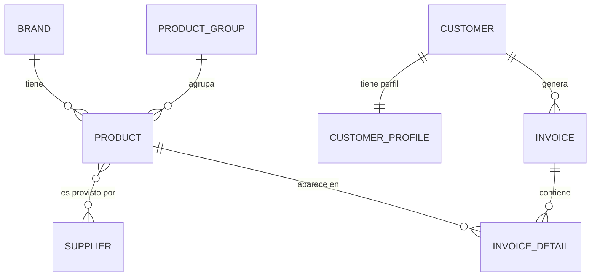

# 🧾 Sistema de Ventas y Facturación (Sales_A2)

Aplicación web desarrollada en **Django** para la gestión integral de un sistema de ventas y facturación. Permite administrar marcas, grupos de productos, proveedores, productos, clientes e invoices, con cálculo automático de impuestos (IVA al 15%), búsqueda avanzada, exportación a PDF/Excel, gestión de imágenes de productos y selección dinámica de columnas visibles en los listados.

> **Proyecto académico** — Ingeniería de Software, Universidad Estatal de Milagro (UNEMI)
>
> **Participantes:** Isaac Silva, Marcos Robinson  
> **Universidad:** UNEMI  
> **Fecha:** 22 de junio de 2026

---

## 📑 Tabla de contenidos

- [Características](#-características)
- [Tecnologías](#-tecnologías)
- [Estructura del proyecto](#-estructura-del-proyecto)
- [Modelo de datos](#-modelo-de-datos)
- [Requisitos previos](#-requisitos-previos)
- [Instalación y configuración](#-instalación-y-configuración)
- [Ejecución](#-ejecución)
- [Uso de la aplicación](#-uso-de-la-aplicación)
- [Decisiones de diseño](#-decisiones-de-diseño)
- [Notas y pendientes](#-notas-y-pendientes)
- [Autores](#-autores)

---

## ✨ Características

- **CRUD completo** para 6 módulos: Marcas, Grupos de productos, Proveedores, Productos, Clientes y Facturas.
- **Vistas detalladas** (DetailView) para todos los módulos con información completa de cada registro.
- **Sistema de facturación** con líneas de detalle dinámicas (agregar/quitar productos en la misma pantalla).
- **Cálculo automático** de subtotal, IVA (15%) y total al guardar una factura.
- **Autenticación de usuarios**: registro (signup), inicio y cierre de sesión.
- **Acceso protegido**: todas las pantallas requieren sesión iniciada (LoginRequiredMixin).
- **Búsqueda y filtros avanzados** en todos los listados (por nombre, estado, rango de precios/fechas, etc.).
- **Exportación de datos** a PDF y Excel desde cualquier listado respetando las columnas seleccionadas.
- **Selectores de columnas dinámicos** en todos los listados con persistencia en localStorage.
- **Gestión de imágenes** de productos con vista previa en los listados.
- **Interfaz responsiva** con Bootstrap 5 e iconos con Bootstrap Icons.
- **Panel de administración** de Django habilitado para todos los modelos.
- **Validación de datos** con validadores customizados (ej: cédula ecuatoriana en clientes).
- **Protección de integridad referencial** con ON_DELETE PROTECT/CASCADE apropiados.

---

## 🛠 Tecnologías

| Componente        | Tecnología                             |
|-------------------|----------------------------------------|
| Lenguaje          | Python 3.13                            |
| Framework         | Django 6.0.6                           |
| Base de datos     | SQLite 3                               |
| Frontend          | Bootstrap 5.3 (vía CDN)                |
| Iconos            | Bootstrap Icons 1.11.3 (vía CDN)       |
| Estilos en forms  | django-widget-tweaks 1.5.1             |
| Exportación PDF   | ReportLab 4.2.5                        |
| Exportación Excel | openpyxl 3.1.5                         |
| Gestión imágenes  | Pillow 12.2.0                          |
| Idioma / Zona     | Español (es-ec) / UTC                  |

---

## 📂 Estructura del proyecto

```
Sales_A2/
├── config/                     # Configuración del proyecto Django
│   ├── settings.py             # Ajustes (BD, apps, idioma, login)
│   ├── urls.py                 # Rutas raíz (admin, accounts, billing)
│   ├── asgi.py / wsgi.py       # Puntos de entrada del servidor
│   └── __init__.py
│
├── billing/                    # App principal (lógica de negocio)
│   ├── migrations/             # Migraciones de la base de datos
│   ├── templates/billing/      # Plantillas HTML del módulo
│   │   ├── base.html           # Plantilla base (navbar, footer, mensajes)
│   │   ├── *_list.html         # Listados con selectores de columnas dinámicos
│   │   ├── *_detail.html       # Vistas detalladas de cada entidad
│   │   ├── *_form.html         # Formularios de crear/editar
│   │   └── *_confirm_delete.html  # Confirmaciones de borrado
│   ├── models.py               # Modelos (8 entidades)
│   ├── views.py                # Vistas (FBV + CBV) con ExportMixin
│   ├── forms.py                # Formularios y formset de factura + SearchForms
│   ├── mixins.py               # ExportMixin (PDF/Excel con ReportLab/openpyxl)
│   ├── urls.py                 # Rutas de la app billing
│   └── admin.py                # Registro de modelos en el admin
│
├── shared/                     # Utilidades compartidas
│   ├── validators.py           # Validadores customizados (cédula EC)
│   ├── mixins.py               # Mixins reutilizables
│   └── decorators.py           # Decoradores personalizados
│
├── templates/
│   └── registration/           # Plantillas de autenticación
│       ├── login.html
│       └── signup.html
│
├── media/
│   └── products/               # Imágenes subidas de productos
│
├── static/                     # Archivos estáticos (CSS/JS/imágenes)
├── dbsalesA2.sqlite3           # Base de datos SQLite
├── manage.py                   # Utilidad de gestión de Django
├── requirements.txt            # Dependencias del proyecto
└── README.md                   # Este archivo
```

---

## 🗃 Modelo de datos

El sistema se compone de **8 entidades** relacionadas entre sí.

### Diagrama entidad–relación



### Descripción de las entidades

**Brand** (Marca) — Marcas de los productos.

| Campo        | Tipo          | Notas                  |
|--------------|---------------|------------------------|
| name         | CharField     | Único, obligatorio     |
| description  | TextField     | Opcional               |
| is_active    | BooleanField  | Por defecto `True`     |
| created_at   | DateTimeField | Automático al crear    |
| updated_at   | DateTimeField | Automático al editar   |

**ProductGroup** (Grupo de productos) — Categorías de productos.

| Campo      | Tipo         | Notas              |
|------------|--------------|--------------------|
| name       | CharField    | Único, obligatorio |
| is_active  | BooleanField | Por defecto `True` |

**Supplier** (Proveedor) — Empresas que abastecen productos.

| Campo         | Tipo        | Notas                          |
|---------------|-------------|--------------------------------|
| name          | CharField   | Nombre de la compañía          |
| contact_name  | CharField   | Persona de contacto (opcional) |
| email         | EmailField  | Opcional                       |
| phone         | CharField   | Opcional                       |
| address       | TextField   | Opcional                       |
| is_active     | BooleanField| Por defecto `True`             |

**Product** (Producto) — Artículos a la venta.

| Campo       | Tipo                | Notas                                  |
|-------------|---------------------|----------------------------------------|
| name        | CharField           | Obligatorio                            |
| description | TextField           | Opcional                               |
| brand       | ForeignKey → Brand  | `PROTECT` (no borra si está en uso)    |
| group       | ForeignKey → Group  | `PROTECT`                              |
| suppliers   | ManyToMany → Supplier | Varios proveedores por producto      |
| unit_price  | DecimalField        | Precio unitario                        |
| stock       | IntegerField        | Existencias, por defecto `0`           |
| image       | ImageField          | Imagen del producto, opcional          |
| is_active   | BooleanField        | Por defecto `True`                     |
| created_at  | DateTimeField       | Automático al crear                    |
| updated_at  | DateTimeField       | Automático al editar                   |

> Incluye la propiedad `balance` que calcula `unit_price × stock`.

**Customer** (Cliente) — Personas o empresas que compran.

| Campo       | Tipo        | Notas                                                 |
|-------------|-------------|-------------------------------------------------------|
| dni         | CharField   | DNI/RUC, único, validado con cédula ecuatoriana      |
| first_name  | CharField   | Nombre                                                |
| last_name   | CharField   | Apellido                                              |
| email       | EmailField  | Opcional                                              |
| phone       | CharField   | Opcional                                              |
| address     | TextField   | Opcional                                              |
| is_active   | BooleanField| Por defecto `True`                                    |
| created_at  | DateTimeField | Automático al crear                                  |
| updated_at  | DateTimeField | Automático al editar                                 |

> Incluye la propiedad `full_name` que devuelve `nombre + apellido`.
> DNI/RUC es validado automáticamente usando validador de cédula ecuatoriana.

**CustomerProfile** (Perfil del cliente) — Datos extendidos, relación 1:1 con Customer.

| Campo         | Tipo         | Notas                                          |
|---------------|--------------|------------------------------------------------|
| taxpayer_type | CharField    | Tipo de contribuyente (Final/RUC/RISE)         |
| payment_terms | CharField    | Forma de pago (contado / crédito 15/30/60 días)|
| credit_limit  | DecimalField | Límite de crédito                              |
| notes         | TextField    | Observaciones                                  |

**Invoice** (Factura) — Cabecera de la factura.

| Campo        | Tipo                  | Notas                              |
|--------------|-----------------------|------------------------------------|
| customer     | ForeignKey → Customer | `PROTECT`                          |
| invoice_date | DateTimeField         | Fecha automática al crear          |
| subtotal     | DecimalField          | Calculado por la vista             |
| tax          | DecimalField          | IVA (15%), calculado por la vista  |
| total        | DecimalField          | `subtotal + tax`, calculado        |
| is_active    | BooleanField          | Por defecto `True`                 |

**InvoiceDetail** (Detalle de factura) — Líneas de la factura.

| Campo      | Tipo                  | Notas                                       |
|------------|-----------------------|---------------------------------------------|
| invoice    | ForeignKey → Invoice  | `CASCADE` (se borra con la factura)         |
| product    | ForeignKey → Product  | `PROTECT`                                   |
| quantity   | IntegerField          | Cantidad, por defecto `1`                   |
| unit_price | DecimalField          | Precio unitario                             |
| subtotal   | DecimalField          | Calculado automáticamente: `cantidad × precio` |

---

## 📋 Requisitos previos

- **Python 3.13** (o compatible) instalado y disponible en el PATH.
- **pip** (incluido con Python).
- Verifica la instalación con:

```bash
python --version
pip --version
```

---

## ⚙️ Instalación y configuración

> Los comandos están pensados para **Windows (CMD)**. En Linux/Mac se activa el entorno con `source ent_sales_A2/bin/activate`.

**1. Ubícate en la carpeta del proyecto**

```cmd
cd Sales_A2
```

**2. Crea un entorno virtual**

```cmd
python -m venv ent_sales_A2
```

> El entorno virtual **no se comparte entre computadoras**. Si copiaste el proyecto de otra PC, borra la carpeta `ent_sales_A2` y vuelve a crearla con este comando.

**3. Activa el entorno virtual**

```cmd
ent_sales_A2\Scripts\activate
```

**4. Instala las dependencias**

```cmd
pip install -r requirements.txt
```

**5. Aplica las migraciones** (crea/actualiza las tablas de la base de datos)

```cmd
python manage.py migrate
```

**6. Crea un superusuario** (para acceder al admin y poder iniciar sesión)

```cmd
python manage.py createsuperuser
```

---

## ▶️ Ejecución

Con el entorno virtual activado:

```cmd
python manage.py runserver
```

Luego abre en el navegador:

| Recurso              | URL                                      |
|----------------------|------------------------------------------|
| Aplicación           | http://127.0.0.1:8000/                   |
| Panel de administración | http://127.0.0.1:8000/admin/          |
| Inicio de sesión     | http://127.0.0.1:8000/accounts/login/    |
| Registro             | http://127.0.0.1:8000/signup/            |

---

## 🧭 Uso de la aplicación

### Flujo general

1. **Regístrate o inicia sesión.** Sin sesión activa, todas las pantallas redirigen al login.
2. **Carga los catálogos base** en este orden recomendado:
   - Marcas → Grupos → Proveedores → Productos → Clientes
   - (Un producto necesita una marca y un grupo existentes; una factura necesita clientes y productos).
3. **Crea una factura:**
   - Selecciona el cliente.
   - Agrega una o varias líneas de detalle (producto, cantidad, precio) con el botón **+ Agregar producto**.
   - Al guardar, el sistema calcula automáticamente:
     - `subtotal` = suma de los subtotales de cada línea
     - `tax` = 15% del subtotal (IVA)
     - `total` = subtotal + IVA

### Características en los listados

En **todos los listados** (Marcas, Grupos, Proveedores, Productos, Clientes, Facturas):

- **Búsqueda y filtros**: formularios en la parte superior para filtrar por campo, estado, rango de fechas/precios, etc.
- **Columnas seleccionables**: botón "Campos" con un modal que permite elegir qué columnas ver. Las preferencias se guardan en `localStorage`.
- **Exportación**: botones "PDF" y "Excel" que exportan **solo las columnas seleccionadas**.
- **Vista detallada**: botón azul "Ver" (icono ojo) para ver todos los datos de un registro en una página dedicada.
- **Editar**: botón naranja "Editar" (icono lápiz) para modificar el registro.
- **Eliminar**: botón rojo "Eliminar" (icono basura) con confirmación.
- **Imágenes**: en Productos, se ve la imagen miniaturizada si existe (vía Pillow).
- **Paginación**: navegación entre páginas con conservación de filtros y búsqueda.

### Rutas principales

| Módulo      | Listado          | Crear                    | Ver (Detail)             |
|-------------|------------------|--------------------------|--------------------------|
| Marcas      | `/brands/`       | `/brands/create/`        | `/brands/<id>/`          |
| Grupos      | `/groups/`       | `/groups/create/`        | `/groups/<id>/`          |
| Proveedores | `/suppliers/`    | `/suppliers/create/`     | `/suppliers/<id>/`       |
| Productos   | `/products/`     | `/products/create/`      | `/products/<id>/`        |
| Clientes    | `/customers/`    | `/customers/create/`     | `/customers/<id>/`       |
| Facturas    | `/invoices/`     | `/invoices/create/`      | `/invoices/<id>/`        |

---

## 🧩 Decisiones de diseño

Esta sección explica el *por qué* de las principales decisiones técnicas.

### Vistas basadas en funciones (FBV) vs. en clases (CBV)

El proyecto combina ambos enfoques de forma intencional:

- **FBV** (`invoice_create`, `invoice_detail`): se usan donde conviene controlar manualmente el flujo `GET`/`POST`. El caso de **factura** lo requiere porque coordina **dos formularios a la vez** (la cabecera y el *formset* de detalles) y además calcula los totales antes de guardar — algo que en una vista genérica resulta forzado.
- **CBV** (`Brand`, `ProductGroup`, `Supplier`, `Product`, `Customer` con `ListView`, `DetailView`, `CreateView`, `UpdateView`, `DeleteView`): usan las vistas genéricas de Django, que reducen el código repetitivo de un CRUD estándar.

### Selectores de columnas dinámicos con localStorage

Cada listado define un diccionario `*_ALL_COLUMNS` con metadatos sobre cada columna:

```python
PRODUCT_ALL_COLUMNS = [
    {'key': 'name', 'label': 'Nombre', 'default': True, 'export': ('name', 'Nombre')},
    ...
]
```

- **`key`**: identificador único de la columna.
- **`label`**: etiqueta mostrada en la UI.
- **`default`**: si se muestra por defecto.
- **`export`**: tupla `(source, label)` para exportación (puede ser string, dotted path, o función).

En la plantilla, JavaScript con `localStorage` permite toggling de columnas persistente. Al exportar, solo se incluyen las columnas activas.

### ExportMixin para PDF y Excel

- **PDF**: ReportLab genera documentos con tabla, encabezados coloreados, orientación dinámica según número de columnas.
- **Excel**: openpyxl formatea celdas con colores, bordes, alineación.
- Ambas respetan las columnas activas del listado (via URL `?cols=name,price,...&export=pdf`).

### Bootstrap e iconos en templates (no en `forms.py`)

Las clases de Bootstrap se aplican en la **plantilla** mediante `django-widget-tweaks`, no en los widgets del formulario. Esto mantiene `forms.py` libre de detalles de presentación. Los iconos usan **Bootstrap Icons** cargados vía CDN: azul (ojo) para Ver, naranja (lápiz) para Editar, rojo (basura) para Eliminar.

### Búsqueda multi-campo con Q objects

Cada módulo tiene un `*SearchForm` que permite filtrar por múltiples campos usando Q objects en la queryset:

```python
Q(name__icontains=...) | Q(email__icontains=...)
```

Esto permite buscar un cliente por nombre, email o DNI simultáneamente.

### Validación de DNI ecuatoriano

El campo `Customer.dni` incluye un validador customizado que verifica que sea una cédula ecuatoriana válida:

```python
dni = models.CharField(..., validators=[validate_cedula_ec])
```

### Imágenes de productos con Pillow

- Los productos pueden tener una imagen (ImageField → `media/products/`).
- En el listado se muestra miniaturizada (48×48px).
- En el detail, se muestra en mayor tamaño.

### Integridad referencial (`on_delete`)

- **`PROTECT`** en `Product.brand`, `Product.group`, `Invoice.customer` e `InvoiceDetail.product`: impide borrar un registro que está siendo usado.
- **`CASCADE`** en `InvoiceDetail.invoice`: al eliminar una factura, sus líneas de detalle se eliminan automáticamente.

### Cálculos automáticos

- `InvoiceDetail.subtotal` se calcula al guardar: `cantidad × precio_unitario`.
- Los totales de factura (`subtotal`, `tax`, `total`) se calculan en `invoice_create` aplicando **IVA 15%**.

### Seguridad

- Todas las vistas de negocio exigen sesión iniciada (`@login_required` en FBV, `LoginRequiredMixin` en CBV).
- El cierre de sesión se hace por **POST** (no GET) con ``.
- Los formularios de búsqueda se procesan por **GET** para permitir compartir URLs con filtros aplicados.

---

## 📝 Notas y pendientes

### Observaciones técnicas

- **`requirements.txt`** incluye paquetes que no pertenecen a este proyecto (Flask, Jinja2, Werkzeug, etc.), probablemente arrastrados de otro entorno. Para un proyecto Django limpio, las dependencias necesarias son: `Django`, `asgiref`, `sqlparse`, `tzdata`, `django-widget-tweaks`, `openpyxl`, `reportlab` y `pillow`.

- **`settings.py`**: Incluye `MESSAGE_TAGS` para mostrar alertas de error en rojo. Esto funciona correctamente.

- **Directorio `media/`**: Debe existir para almacenar imágenes subidas. Django lo crea automáticamente, pero en producción debe ser accesible vía web server.

- **Validador de cédula**: El validador `validate_cedula_ec` en `shared/validators.py` verifica que la cédula ecuatoriana sea válida según el algoritmo oficial.

### Posibles mejoras futuras

- Agregar reportes (resumen de ventas por período, top 10 productos, etc.).
- Integrar pasarela de pago para facturas en línea.
- Implementar notificaciones por email al crear/actualizar facturas.
- Agregar control de inventario (movimientos de stock, ajustes).
- Historial de auditoría completo (quién creó/editó/borró y cuándo).
- Generar códigos de barras/QR en PDF de facturas.
- API REST para integración con terceros.
- Panel de control (dashboard) con gráficos de ventas.

---

## 👨‍💻 Autores

Proyecto desarrollado por **Isaac Silva** y **Marcos Robinson** — Ingeniería de Software, UNEMI (2026).
